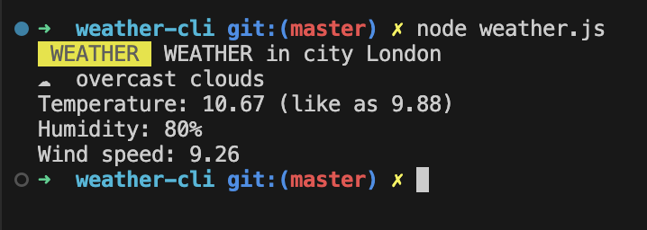

# Weather-CLI

## Result

```console
WEATHER WEATHER in city London
☁️ scattered clouds
Temperature: 9.26 (like as 6.42)
Humidity: 83%
Wind speed: 5.66
```



## Help

```console
HELP
Without params - show weather
-s [CITY] - save your city and show weather
-h - show Help
-t [API_KEY] - save token
```


## Work with

- Getting arguments
- Working with the file system
- Preparing the project as a CLI (Command Line Interface)
- Working with a third-party API
- Styling console output
- Passing environment variables
- Using the OS library
