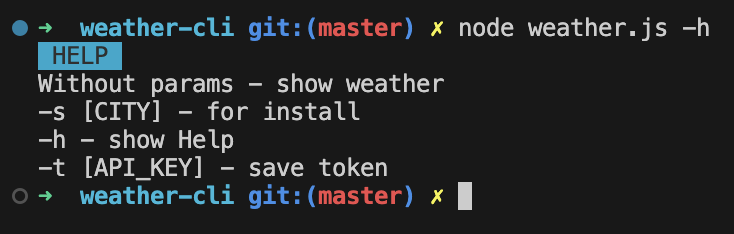

# Weather-CLI

## result

## Work with

- Getting arguments
- Working with the file system
- Preparing the project as a CLI (Command Line Interface)
- Working with a third-party API
- Styling console output
- Passing environment variables
- Using the OS library
